# การติดตั้ง PHP และ Laravel บน Windows

## การติดตั้ง PHP

1. ดาวน์โหลด PHP จาก [เว็บไซต์อย่างเป็นทางการ](https://windows.php.net/download/)
2. เลือกเวอร์ชัน PHP ที่ต้องการ
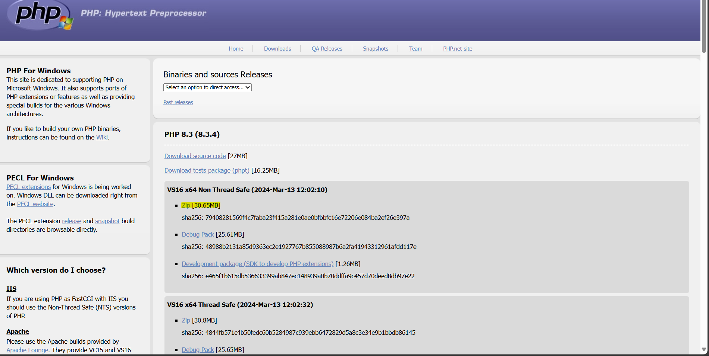
3. แตกไฟล์ zip และย้ายโฟลเดอร์ PHP ไปยัง `C:\php`
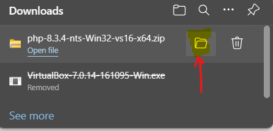
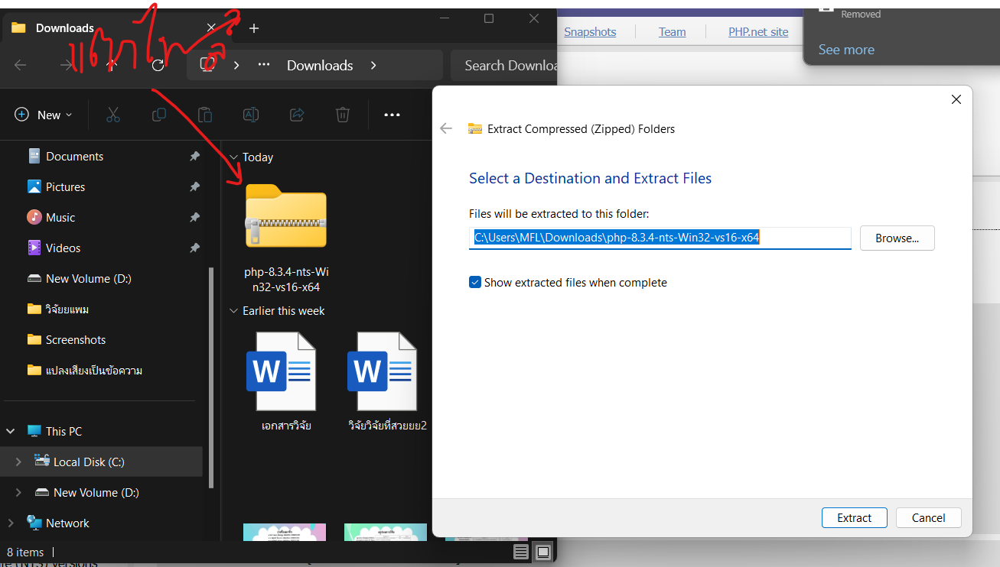
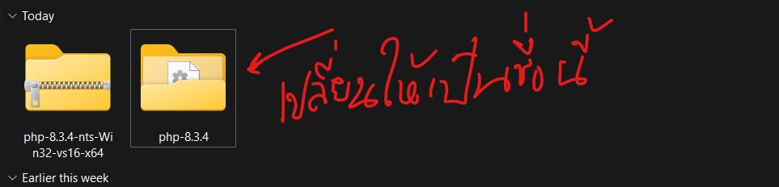
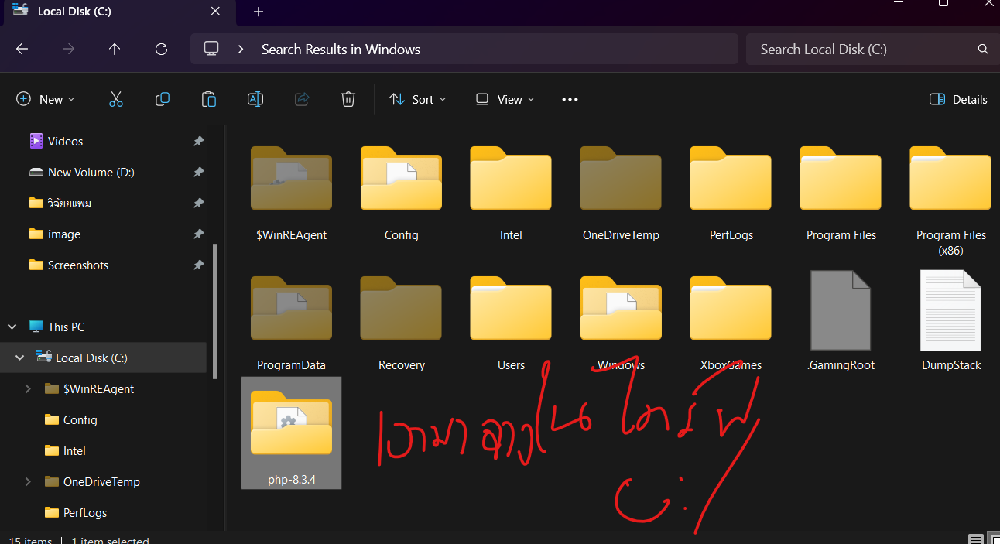
4. เพิ่ม `C:\php` ไปยัง PATH ของระบบ
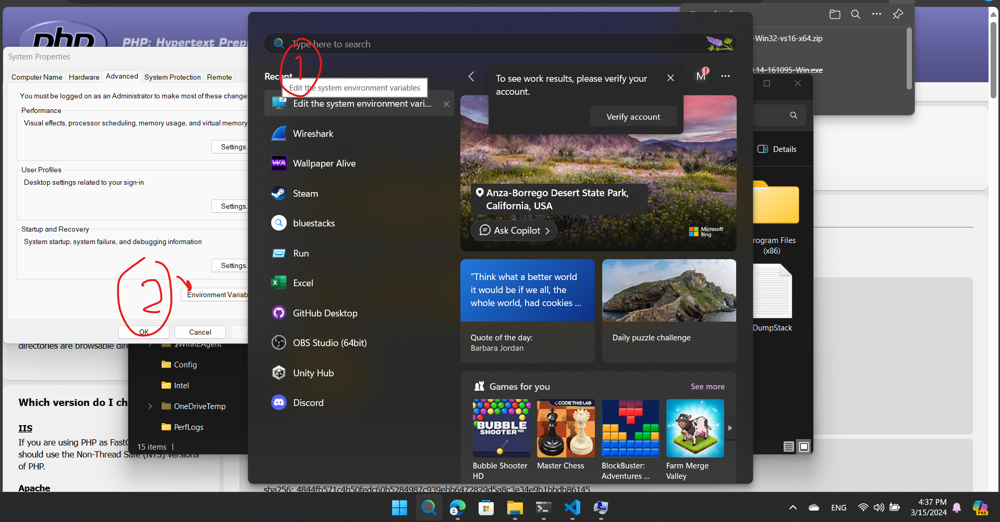
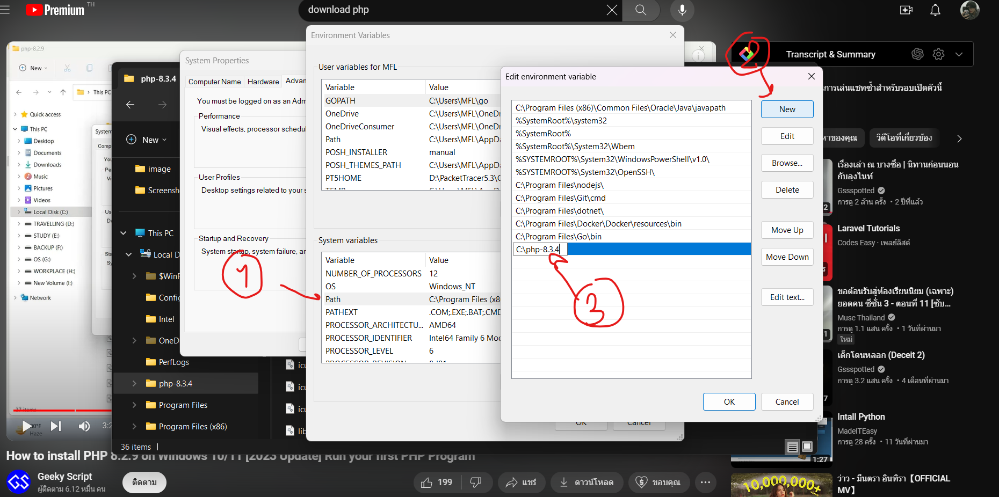
5. ทดสอบการติดตั้งด้วยคำสั่ง `php -v` ใน Command Prompt
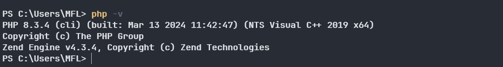

## การติดตั้ง Laravel

1. ติดตั้ง Composer จาก [เว็บไซต์อย่างเป็นทางการ](https://getcomposer.org/download/)
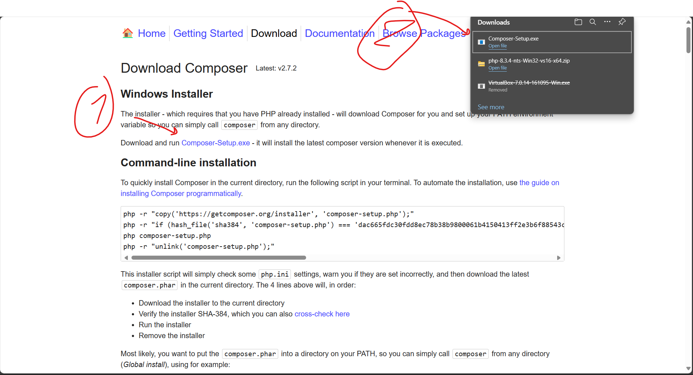
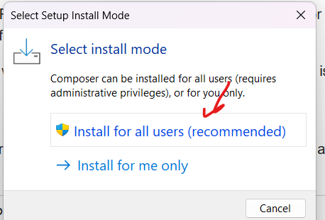
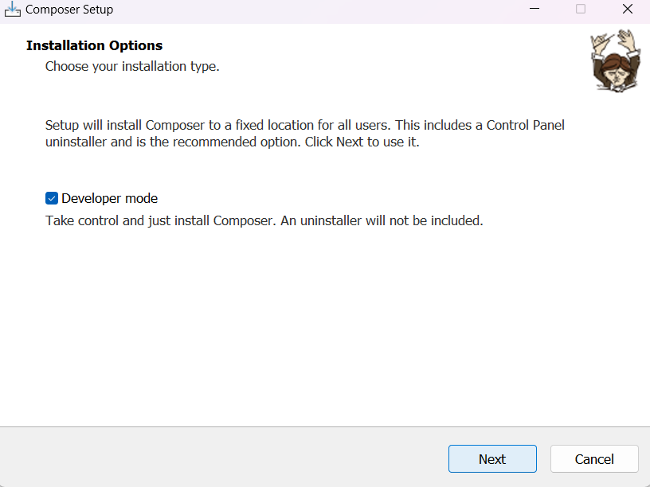
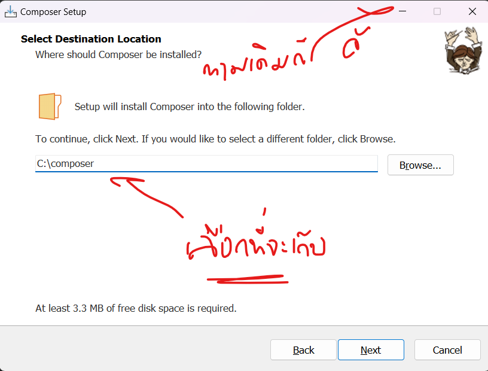
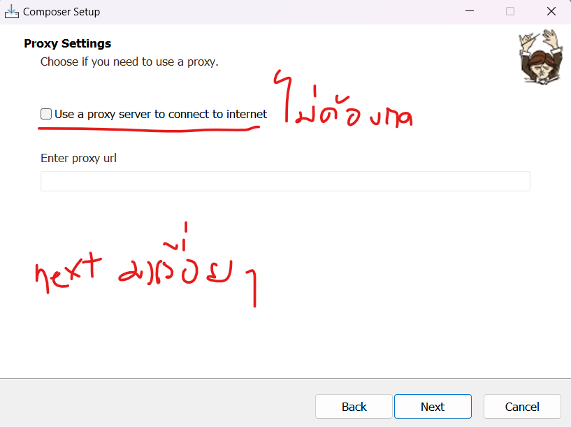
2. ทดสอบการติดตั้ง Composer ด้วยคำสั่ง `composer -v` ใน Command Prompt
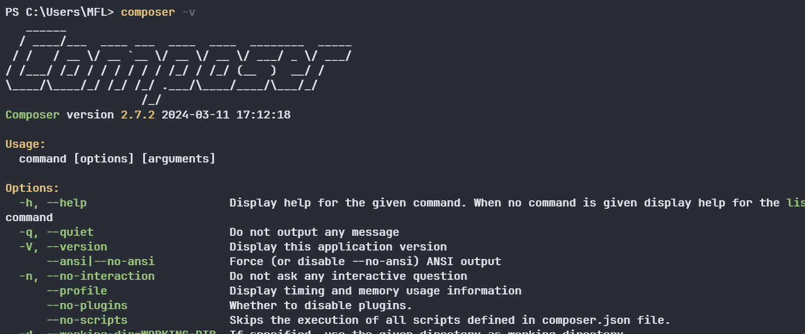

3. ติดตั้ง Laravel ผ่าน Composer ด้วยคำสั่ง `composer global require laravel/installer`
4. เพิ่ม `C:\Users\[username]\AppData\Roaming\Composer\vendor\bin` ไปยัง PATH ของระบบ
5. ทดสอบการติดตั้ง Laravel ด้วยคำสั่ง `laravel -v` ใน Command Prompt

